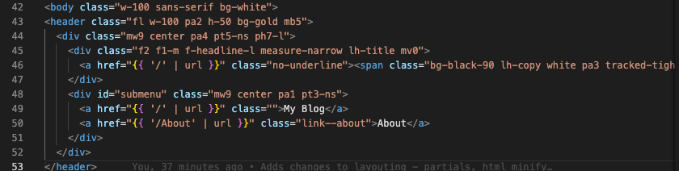

[Eleventy](https://www.11ty.dev) seems like a such a nifty tool for building websites, doesn't it? Yet why, for some things that are basic to it like partials does it seem so obscure for the documentation to find?

Here's the key, slash *TL;DR*: building layouts with Eleventy and partials is way too easy. ***Yet*** *it's not properly advertised (you'd even wish to find it somewhere within the Layouts document or within the [Nunjucks documentation in Eleventy](https://www.11ty.dev/docs/languages/nunjucks/) too, but somehow it doesn't appear)*

***Warning: this could become outdated too, so also please check which version or which year you are working on it, it may have become outdated!***

Whenever you're working with a layouting in Eleventy you will find that, for an example, it's unusual to find them already split into parts, generally examples are bound together in one page (which is neat, considering that [Nunjucks](https://mozilla.github.io/nunjucks/) has a pretty summed up, short and sweet syntax).

I understand, you may say, that partials within the layout is a part of Nunjucks. Nevertheless, if you're going to bind yourself, being Eleventy, to Nunjucks as one of the default options, you should include this kind of examples. 

Nevertheless, like me, you may find yourself working with options like using UI elements from libraries such as Tachyons for CSS. This is alright, expect that the syntax with these sometimes (with Bootstrap this happens as well) becomes swollen and long to the eyes.

So, the idea will be to include the code for a full page, and show you how this gets divided into partials (sections) that you may re-use all over your website.

Take, for instance, the full layout being used for an example I'm working with:

```html
<!DOCTYPE html>
<html lang="en">
<head>
  <meta charset="utf-8">
  <meta name="viewport" content="width=device-width, initial-scale=1"/>
  <title>{{ title }}</title>
  <meta name="description" content="{{ desc or title }}">
  <meta name="keywords" content="{{ title }}">
  <!-- OpenGraph -->
  <meta property="og:title" content="{{ title }}">
  <meta property="og:description" content="{{ desc or title }}">
  <meta property="og:type" content="article">
  <meta property="og:image" content="{{ cover }}"/>
  <meta property="og:image:width" content="1200"/>
  <meta property="og:image:height" content="675"/>
  <!-- Twitter -->
  <meta name="twitter:title" content="{{ title }}">
  <meta name="twitter:card" content="summary_large_image">
  <meta name="twitter:site" content="@xxx">
  <meta name="twitter:description" content="{{ desc or title }}">
  <meta name="twitter:image" content="{{ cover }}">
  <meta name="twitter:creator" content="@xxx">
  <link rel="stylesheet" href="https://unpkg.com/tachyons@4.12.0/css/tachyons.min.css" rel="preload" as="style"/>
  <link rel="preload" href="https://unpkg.com/prismjs@1.20.0/themes/prism-okaidia.css" rel="stylesheet">
  <noscript>
    <link rel="preload" rel="stylesheet" href="/css/site.css">
  </noscript>
  <script async
          src="https://www.googletagmanager.com/gtag/js?id={{ env.tracking.gtag }}">
  </script>
  <script>
    window.dataLayer = window.dataLayer || [];

    function gtag() {
      dataLayer.push(arguments);
    }

    gtag('js', new Date());
    gtag('config', 'XXXX');
  </script>
</head>

<body class="w-100 sans-serif bg-white">
<header class="fl w-100 pa2 h-50 bg-gold mb5">
  <div class="mw9 center pa4 pt5-ns ph7-l">
    <div class="f2 f1-m f-headline-l measure-narrow lh-title mv0">
      <a href="{{ '/' | url }}" class="no-underline"><span class="bg-black-90 lh-copy white pa3 tracked-tight">Parripollo</span></a>
    </div>
    <div id="submenu" class="mw9 center pa1 pt3-ns">
      <a href="{{ '/' | url }}" class="">My Blog</a>
      <a href="{{ '/About' | url }}" class="link--about">About</a>
    </div>
  </div>
</header>
<main class="pa4 ph7-l mw9-l center pv3">

  {{ content | safe }}

</main>
<footer class="pa4 ph7-l mw9-l center bt b--black-10 black-70">
  <a href="mailto:" class="link b f3 f2-ns dim black-70 lh-solid">XXXX</a>
  <p class="f6 db b ttu lh-solid">© 2021 XXXX.</p>
  <div class="mt5">
    <a href="/about/" title="About" class="f6 dib pr2 mid-gray dim">About</a>
    <a href="/terms/"    title="Terms" class="f6 dib ph2 mid-gray dim">Terms of Use</a>
    <a href="/privacy/"  title="Privacy" class="f6 dib pl2 mid-gray dim">Privacy</a>
  </div>
</footer>
</body>
</html>
```

### Quite long, ain't it? ###

What should we do?

In this case, create .njk files for the sections we use, copy literally the code we're going to use, and then include the sections from the files as follows:

```

```

where _name of the file_ is the name of the partial you're including.

That's it! Pretty silly, but could have used a short article for it. After shortening this up, the code becomes:

```


<main class="pa4 ph7-l mw9-l center pv3 sans-serif lh-copy tj">

  {{ content | safe }}

</main>


```

### And then what? ###

And you paste your sections into your _header.njk and _footer.njk files within your _sections folder (I've built the folder structure like this, but this doesn't mean you **HAVE** to use the same structure as me.)

Good luck!
