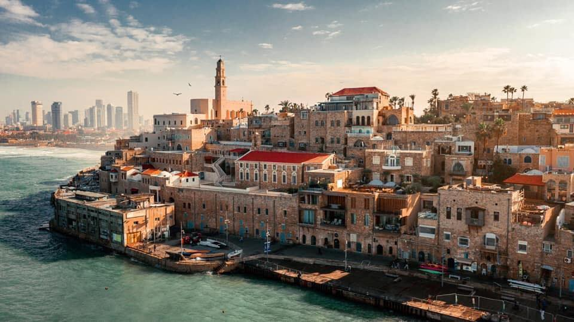

## DISCLAIMER: This post contains non-technical and even personal questions, and is not meant as a complaint nor on Israel nor its people. It's merely a reflection of the situation I underwent while living in the middle east. If this should resonate with you, if you should have questions, need help or a listening ear, feel free to hit me up

Back in 2017, I decided to make aliyah from my country of birth, Argentina, to Israel. It was a sound choice, as Argentina's economical socio-political situation always seems to worsen (and has been like that for decades now). Coming from South America, from third world countries, some aspects of living in Israel seem incredibly good, and for the first few months you see yourself amazed at the level the country operates on certain aspects. I was.
My first few months were a honeymoon of dream and optimism in the face of hardship, loneliness and other factors. I had become an israeli.
I was an argentine, but now I'm an israeli.

As time passed by I grew accustomed to things: the mercaz klitah and its people, great buses, expensive housing, cottage cheese (still missing it as it's not sold in Argentina), the heat, the perfumes, the shuks, Yafo, Tel Aviv, Ra'anana, the beaches, working odd jobs in hotels and malls, eating shakshuka in the mornings while working in hotels from Eilat to the north, Goldstar filtered and Maccabi, watching Barcelona matches on betting stands, getting bused from the south to the north in less than 12 hours, and eating kilos of tehina and hummus on schnitzels, falafels, shawarmas and so forth. In some ways, first world living, in other ways, third world living, a lifestyle of becoming disengaged from the glam and glitz of being able to own first hand quality goods, clothes, cars, being able to rent alone, for a life of shutafim (flatmates), cold beers in the evening, second hand furniture and appliances, checking out books at the bus stops or second hand stores, and so forth. The material disengagement itself was not bad: it taught you to become unattached to unnecessary things for life itself. It's like this for more than 70% percent of israelis and for 90% of south american olim you talk to. A change in habits.

## This is where it turns dark, sorry, but it's the truth.

This was very nice, but, as every story, it has its terrible downs as well. Following a few months, you start to realise certain things aren't so. The human side of things is lacking. You're not an israeli. You're an ole/olah/olim. You're a part of the country but you're not quite it. You're that guy test-driving the car but not its owner yet. You're, in certain ways, second class. You're not that welcome (you, as me, probably heard too many times the common phrase that says: "When you are about to make aliyah, everyone in Israel asks you when you arrived, and once you're there, everyone asks you why you came, what for"). Do you speak the language properly on your first six months in the country, even if you have been learning the language for three years before getting to the country? According to israelis, no, even if they themselves also do not speak properly (_do a quick quiz on gender-based number usage -- and which should be used-- in hebrew and you'll see_).
Well, if you don't speak hebrew properly, we don't care about your 13 year experience as a digital marketer, or 3 years as a developer: you're going to be a _bitajon_ -security guard- or _melzarit_ -waiter- or a cleaning employee in a mall or a hotel. These menial jobs will give you everything you need to get the greater feel of the israeli way of life. This is bullshit. Prepare to get ripped off on your working wages and hours (especially if you don't keep a tight register of your weekly/monthly worked hours) for minimum wage, get yelled at, mistreated just because. All the things you left your country for, minus the economical and socio-political unstability. Your earnings will be just enough to scrape by, and you'll probably be like 100-200 in the red at the bank always at the end of the month-- this kind of financial uncertainty in Israel is so common it hurts.

> This is, unfortunately, so. Any citizen of Israel living there for a good time will tell you: well, you've got to earn your spurs, to pay the price,
> Israel wasn't a given. My millenial side of things (almost centennial I'd say) will tell you too: You're a human being too, and as valid as any of
> these people. You're not any less than any of them. This is bullshit you do not need to put up with: call them on it **every-time**.

And above all, I was feeling terribly alone, too far away from the ones I love, neglected by family living in Israel (sorry folks, but unless your family is _too close_ you'll probably be ignored as well by your next of kin), and all in all, feeling like we say in spanish "sapo de otro pozo" (a toad/frog from a different well). I wasn't making any friends, no matter what skinned knee puppy face I would put. Reaching out to israelis for friendships just isn't so. Unless in certain cases when you're being proper looked to be swindled for money. The humanity you feel in your original country is gone, and the myth of the sabras is... well, a myth. There's no sweetness inside, sorry.

After almost a year, worn out, alone, ragged, and also due to other reasons I would discover later (my mother was in the early stages of cancer by then, we just didn't know it and mistook it for symptoms of something else), and after roaming the streets and living in different places for a while, I simply decided to call it quits. Surely, you have to take the bad with the good. You chose to live there. You chose to move and pick your bags and get on a plane. In some way or another you had to know also what you were signing up for, too. All of this given... dayenu. Maspik, dai. Enough.
Home is where the heart is, right? Well, it wasn't there.

This doesn't mean that I don't have a truckload of respect for the people living there. Or that it is not a great country. I have, and live through, an ambiguous sensation of being a zionist in the diaspora by choice. I couldn't just move those or that I loved to Israel. I couldn't make myself be loved there either. I couldn't be a part of something that essentially didn't involve me in it. I couldn't stay.

Many would say in this situation: "well, think it over", "don't make a hasty decision", "give it some time, it grows on you". But the truth is, sitting alone on a room on shabbos, looking at the roof, thinking over on all of the things that made me happy, waiting for everything motzaei shabbos just wasn't for me, and this was one of the little things: You don't need to be a part of this. And despite what anyone would think (and you should not give two fucks about): it's your life and you alone can judge it. Many people refuse to leave on account of the guilt, for an example, it causes to them to not be able to repay the faith the Israeli state has had in them. I disagree. In all the time you've been there, working, consuming, you have more than enough repaid your sal klitah amounts. Ask in this case too, what your country could have done for you, and you'll see what's lacking.

> I decided to leave. No looking back. No regrets. You tried, despite what anybody says.

## The paradox of 'being a true zionist'.

Don't feel threatened if you become catcalled a traitor, a wussy or someone unfit to live there. Not everyone is so strong on the cause, and not everyone also is prepared or feels obliged to tolerate consecutive layers of verbal / psychological abuse. Internet forums are a boatload of raging so-called zionists spouting out hate to anyone who has decided to make yeridah, to leave. Some of them have made some kind of a life for themselves (although you may notice **none** of them is rich), and some are straightforward deluded, crazy or just blind to facts. Your life is your life, and support to Israel does not mean unconditional acceptance of every-little-thing. A few of them also want to leave, but that wouldn't be proud zionist.
'Isms' suck. You should embrace a home for all jews, yes, but also expect that _to actually be_ a home for _all_ jews. Fundamentalism is not what anyone should populate a country for.

## Procedure:

The non emotional aspect of this process involves thinking about the following things (and following this checklist, not necessarily in this order, but this is commendable):

- Cancelling non-vital services (cable, internet, kupat jolim -if in good health- and other private services-- _not yet your cellphone!_). Please be assured to ask for some sort of receipt of being free-of-debt or of effective cancellation of said service. Your bank, if you decide to close it, could demand it or try to come with pending charges and so forth in order to deter you from closing your account, should you decide to close it.
- Cancelling any sal klitah or other emoluments you could / should be receiving (given the case this is your first seven months or year)
- Heading to bituach leumi, filling out [form 627](https://www.btl.gov.il/English%20Homepage/About/Forms%20Authorization/Forms/Insurance%20and%20Collection/Pages/627%20-%20Questionnaire%20for%20Determination%20of%20Citizenship%20for%20People%20Abroad.aspx?fbclid=IwAR22p2fYN7di_kmv8TznUbPeuGyXV-uSKbhKWuMmIQmw-ThN-4DwOHYNkDM) - which is nituk toshavut, basically stating that you'll be leaving to reside outside permanently, thus decreasing your monthly bituach leumi payments, if you want to continue paying because you know you'll go back-- and sparing yourself of a six month waiting period to receive medical coverage when you go back, or deciding not to pay at all, because you have decided not to go back but do not want to give up on your citizenship.
- Closing your bank account and/or taking out the remainder of your funds. Do this a few days before departing, and try to leave things as cleared out as possible (eg. cancelled services on automatic debit are fully paid up and so forth)
- **Changing your cellphone subscription to a non- pre-paid subscription**. This is something I didn't do, and woefully regret it. Should you decide for an example to keep your bank account, or operate in any way outside the country with your id, for any kind of process, the first thing you'll be asked for is for your phone number. **Don't cancel your account, just change it**. This, in the end, is a non or small-cost compared to the benefits it implies (For an example, Argentina itself is really privative when it comes to its monetary operation or benefits to any situation you may still be running in Israel, this is not necessary for first world countries, but for South American ones, it is still an advantage for many reasons I cannot detail here ;-) )

For more or updated instructions on it, check out this [facebook post](https://www.facebook.com/notes/leaving-israel-the-official-yerida-group-for-people-who-want-to-gtfo/leaving-israel-a-step-by-step-checklist/2274454212822386/) with exhaustive information.

## Conclusion of this tale

I left, after about almost a year. Came back to Argentina, surpassed a few ups and downs, followed through- accompanied my mom through all of the phases of her cancer treatment. She lived, luckily. It took me a few months to score a job again. Worked one job, and then, made the switch over to web development. Couldn't be more glad, as it was the change I was expecting. No regrets in coming back. Got back to my loved ones. Gave special value to the little things. Lost some money and time on the way, but tough luck. Many of you would definitely **NOT** pick the same option as me.
But nothing's more precious than mental health and peace of mind.

Sometimes failure, if implied, seems like a difficult option to take. However, looking at it from a glass half full perspective as well, and as a standpoint, is the only one to take. Sometimes pulling back to advance at full force is not only preferrable, is necessary. Once again, thanks for reading this along, and for the long speech and everything.

- **TL/DR: Bear with the hard choices, as sometimes even with the hardest choices come the better chances.**
